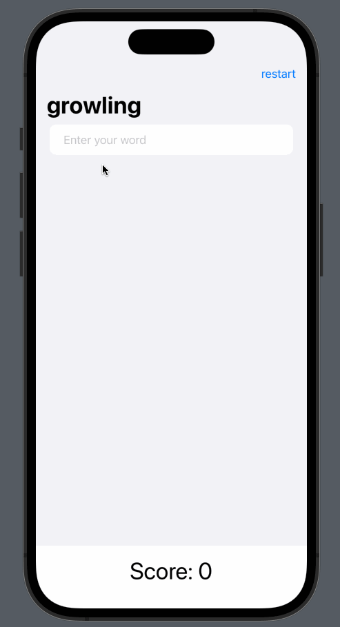

# LearningSwiftUI

[100 Days of SwiftUI](https://www.hackingwithswift.com/100/swiftui) 的全部项目。

文档分成了两部分，Readme 是关于项目的演示，还有一些用法放在了 [常用操作](https://github.com/yangfurui/LearningSwiftUI/blob/main/%E5%B8%B8%E7%94%A8%E6%93%8D%E4%BD%9C.md)。

## 1. WeSplit

WeSplit，根据消费金额和应付小费，计算账单应付款项和 AA 制下每人的应付款项。

你会学习到：

- `Form`
- `NavigationView`
- `@State`
- `Picker`

### 项目演示

## 2. GuessTheFlag

根据国家名选择国旗的小游戏。

你会学习到：

- `VStack`
- `Image`
- `LinearGradient`
- `Alert`

### 项目演示

## 3. RockPaperScissors

猜拳小游戏，随机出一个石头、剪刀、布，然后会提示你是需要赢还是输，做出正确的选择就能得分或者扣分，或者平局就会被嘲讽，三次后会重启游戏。

你会学习到：

- 自定义 `modifier`

### 项目演示

## 4. BetterRest

这个项目有点牛逼，用到了机器学习，CoreML 框架，不过学习的数据是已经写好的，直接拷贝的文件。

输入你几点醒，然后想要睡多久，和你一天喝多少杯咖啡，然后可以得出你应该几点上床睡觉。

学习的数据主要有三块、上床睡觉的时间、喝了多少杯咖啡，醒的时间，文件中有 10000 条这种数据，然后通过 CoreML 框架的不断学习，权衡三者的关系，最终算出一个等式，目前的训练结果误差在 160 多秒，算是比较精准的了。

你会学习到：

- `Stepper`
- `DatePicker`
- `DateFormatter`
- `DateComponment`
- 机器学习、 `CoreML`

### 项目演示

## Word Scramble

从导入的文件 `start.txt` 中，随机取出一串字符串，然后从给出的字符串中取出字符拼成一个单词，如果拼写正确则可得到一分，拼写错误或者重复拼写会有错误提示。

你会学习到：

- `List`
- `Bundle`
- `UITextChecker`

### 项目演示

