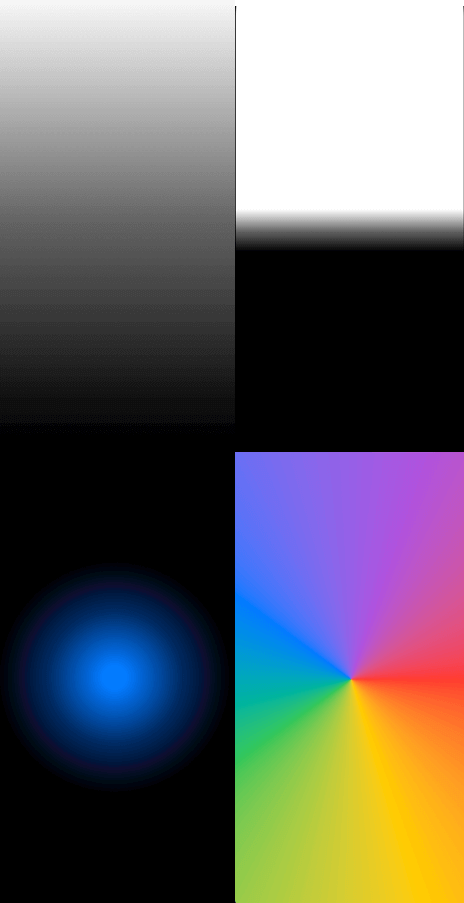
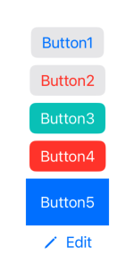
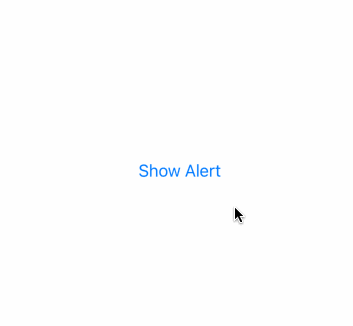

# LearningSwiftUI

[100 Days of SwiftUI](https://www.hackingwithswift.com/100/swiftui) 的全部项目。

## WeSplit
WeSplit，根据消费金额和应付小费，计算账单应付款项和 AA 制下每人的应付款项。

主要使用控件：
- `NavigationView`
- `Form`
- `Section`
- `TextField`
- `Picker`

### 项目演示


## GuessTheFlag

根据国家名选择国旗的小游戏。

主要使用控件：

- 渐变色
- Button
- Alert

### 渐变色

```swift
// 1
LinearGradient(gradient: Gradient(colors: [.white, .black]), startPoint: .top, endPoint: .bottom)

// 2
LinearGradient(gradient: Gradient(stops: [
	.init(color: .white, location: 0.45),
	.init(color: .black, location: 0.55)
]), startPoint: .top, endPoint: .bottom)

// 3
RadialGradient(gradient: Gradient(colors: [.blue, .black]), center: .center, startRadius: 20, endRadius: 200)

// 4
AngularGradient(gradient: Gradient(colors: [.red, .yellow, .green, .blue, .purple, .red]), center: .center)
```

对应的效果：



### Button

```swift
VStack {
    Button("Button1") { }
        .buttonStyle(.bordered)
    
    Button("Button2", role: .destructive) { }
        .buttonStyle(.bordered)
    
    Button("Button3") { }
        .buttonStyle(.borderedProminent)
        .tint(.mint)
    
    Button("Button4", role: .destructive) { }
        .buttonStyle(.borderedProminent)
    
    Button {
        print("Button was tapped!")
    } label: {
        Text("Button5")
            .padding()
            .foregroundColor(.white)
            .background(.blue)
    }
    
    Button {
        print("Edit button was tapped!")
    } label: {
        Label("Edit", systemImage: "pencil")
    }
}
```

效果：



### Alert

```swift
struct ContentView: View {
    @State private var showingAlert = false
    
    var body: some View {
        Button("Show Alert") {
            showingAlert = true
        }
        .alert("Important message", isPresented: $showingAlert) {
            Button("Delete", role: .destructive) { }
            Button("Cancel", role: .cancel) { }
        } message: {
            Text("Please read this")
        }
    }
}
```

效果：



### 项目演示


