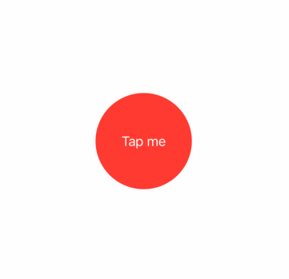

[toc]

# LearningSwiftUI

[100 Days of SwiftUI](https://www.hackingwithswift.com/100/swiftui) 的全部项目。

文档分成了两部分，Readme 是关于项目的演示，还有一些用法放在了 [常用操作](https://github.com/yangfurui/LearningSwiftUI/blob/main/%E5%B8%B8%E7%94%A8%E6%93%8D%E4%BD%9C.md)。

## 1. WeSplit

WeSplit，根据消费金额和应付小费，计算账单应付款项和 AA 制下每人的应付款项。

你会学习到：

- `Form`
- `NavigationView`
- `@State`
- `Picker`

### 项目演示


## 2. GuessTheFlag

根据国家名选择国旗的小游戏。

你会学习到：

- `VStack`
- `Image`
- `LinearGradient`
- `Alert`

### 项目演示


## 3. RockPaperScissors

猜拳小游戏，随机出一个石头、剪刀、布，然后会提示你是需要赢还是输，做出正确的选择就能得分或者扣分，或者平局就会被嘲讽，三次后会重启游戏。

你会学习到：

- 自定义 `modifier`

### 项目演示


## 4. BetterRest

这个项目有点牛逼，用到了机器学习，CoreML 框架，不过学习的数据是已经写好的，直接拷贝的文件。

输入你几点醒，然后想要睡多久，和你一天喝多少杯咖啡，然后可以得出你应该几点上床睡觉。

学习的数据主要有三块、上床睡觉的时间、喝了多少杯咖啡，醒的时间，文件中有 10000 条这种数据，然后通过 CoreML 框架的不断学习，权衡三者的关系，最终算出一个等式，目前的训练结果误差在 160 多秒，算是比较精准的了。

你会学习到：

- `Stepper`
- `DatePicker`
- `DateFormatter`
- `DateComponment`
- 机器学习、 `CoreML`

### 项目演示


## 5. Word Scramble

从导入的文件 `start.txt` 中，随机取出一串字符串，然后从给出的字符串中取出字符拼成一个单词，如果拼写正确则可得到一分，拼写错误或者重复拼写会有错误提示。

你会学习到：

- `List`
- `Bundle`
- `UITextChecker`

### 项目演示


## 6. Animations

### 水波纹动画

```swift
struct ContentView: View {
    
    @State private var animationAmount = 1.0
    
    var body: some View {
        Button("Tap me") {
        }
        .padding(50)
        .background(.red)
        .foregroundColor(.white)
        .clipShape(Circle())
        .overlay(
            Circle()
                .stroke(.red)
                .scaleEffect(animationAmount)
                .opacity(2 - animationAmount)
                .animation(
                    .easeInOut(duration: 1.0)
                        .repeatForever(autoreverses: false),
                    value: animationAmount
                )
        )
        .onAppear {
            animationAmount = 2
        }
    }
}
```

效果：


### 翻转动画

```swift
struct ContentView: View {
    @State private var animationAmount = 0.0
    
    var body: some View {
        Button("Tap me") {
            withAnimation(.interpolatingSpring(stiffness: 5, damping: 1)) {
                animationAmount += 360
            }
        }
        .padding(50)
        .background(.red)
        .foregroundColor(.white)
        .clipShape(Circle())
        .rotation3DEffect(.degrees(animationAmount), axis: (x: 0, y: 1, z: 0))
    }
}
```

效果：



### 蛇动画

```swift
struct ContentView: View {
    let letters = Array("Hello, SwiftUI")
    @State private var enabled = false
    @State private var dragAmount = CGSize.zero
    
    var body: some View {
        HStack(spacing: 0) {
            ForEach(0..<letters.count) { num in
                Text(String(letters[num]))
                    .padding(5)
                    .font(.title)
                    .background(enabled ? .blue : .red)
                    .offset(dragAmount)
                    .animation(
                        .default.delay(Double(num) / 20),
                        value: dragAmount
                    )
            }
        }
        .gesture(
            DragGesture()
                .onChanged { dragAmount = $0.translation }
                .onEnded({ _ in
                    dragAmount = .zero
                    enabled.toggle()
                })
        )
    }
}
```

效果：


### 自定义过渡动画

```swift
struct CornerRotateModifier: ViewModifier {
    let amount: Double
    let anchor: UnitPoint
    
    func body(content: Content) -> some View {
        content
            .rotationEffect(.degrees(amount), anchor: anchor)
            .clipped()
    }
}

extension AnyTransition {
    static var pivot: AnyTransition {
        .modifier(active: CornerRotateModifier(amount: -90, anchor: .topLeading),
                  identity: CornerRotateModifier(amount: 0, anchor: .topLeading))
    }
}

struct ContentView: View {
    @State private var isShowingRed = false
    
    var body: some View {
        ZStack {
            Rectangle()
                .fill(.blue)
                .frame(width: 200, height: 200)
            
            
            if isShowingRed {
                Rectangle()
                    .fill(.red)
                    .frame(width: 200, height: 200)
                    .transition(.pivot)
            }
        }
        .onTapGesture {
            withAnimation {
                isShowingRed.toggle()
            }
        }
    }
}
```

效果：


## 阶段性回顾

目前掌握的技能：

- 如何使用 `Stepper` 读取用户的数字
- 使用 `DatePicker` 让用户输入日期，包括使用 `displayedComponents` 参数来控制日期或时间
- 使用 `Date`、`DateComponents` 和 `DateFormatter` 来处理日期
- 如何引入机器学习以充分利用现代 iOS 设备的全部功能
- 使用 `List` 构建滚动数据表
- 使用 `onAppear()` 在显示视图时运行代码
- 使用 `Bunlde` 类查找路径从应用程序中读取文件，包括从那里加载字符串
- 使用 `fatalError()` 使代码崩溃，以及为什么这实际上可能是一件好事
- 如何使用 `UITextChecker` 检查字符串是否拼写正确
- 使用 `animation()` 修饰符创建隐式动画
- 自定义具有延迟和重复的动画，以及在缓入缓出与弹簧动画之间进行选择

## 7. iExpense

一个记账的小软件，通过 `UserDefault` 存储相关数据。

你会学习到：

- `UserDefaults`
- `AppStorage`
- `@StateObject`
- `sheet()`
- `onDelete()`
- `@Published`
- `Codable`
- `@ObservedObject`

效果：


