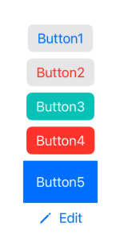
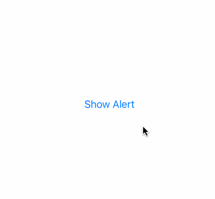

[toc]

## 渐变色

### 

```swift
// 1
LinearGradient(gradient: Gradient(colors: [.white, .black]), startPoint: .top, endPoint: .bottom)

// 2
LinearGradient(gradient: Gradient(stops: [
	.init(color: .white, location: 0.45),
	.init(color: .black, location: 0.55)
]), startPoint: .top, endPoint: .bottom)

// 3
RadialGradient(gradient: Gradient(colors: [.blue, .black]), center: .center, startRadius: 20, endRadius: 200)

// 4
AngularGradient(gradient: Gradient(colors: [.red, .yellow, .green, .blue, .purple, .red]), center: .center)
```

对应的效果：


## Button

```swift
VStack {
    Button("Button1") { }
        .buttonStyle(.bordered)
    
    Button("Button2", role: .destructive) { }
        .buttonStyle(.bordered)
    
    Button("Button3") { }
        .buttonStyle(.borderedProminent)
        .tint(.mint)
    
    Button("Button4", role: .destructive) { }
        .buttonStyle(.borderedProminent)
    
    Button {
        print("Button was tapped!")
    } label: {
        Text("Button5")
            .padding()
            .foregroundColor(.white)
            .background(.blue)
    }
    
    Button {
        print("Edit button was tapped!")
    } label: {
        Label("Edit", systemImage: "pencil")
    }
}
```

效果：



## Alert

```swift
struct ContentView: View {
    @State private var showingAlert = false
    
    var body: some View {
        Button("Show Alert") {
            showingAlert = true
        }
        .alert("Important message", isPresented: $showingAlert) {
            Button("Delete", role: .destructive) { }
            Button("Cancel", role: .cancel) { }
        } message: {
            Text("Please read this")
        }
    }
}
```

效果：



## 自定义 Modifier

```swift
struct Title: ViewModifier {
    func body(content: Content) -> some View {
        content
            .font(.largeTitle)
            .foregroundColor(.white)
            .padding()
            .background(.blue)
            .clipShape(RoundedRectangle(cornerRadius: 10))
    }
}

extension View {
    func titleStyle() -> some View {
        modifier(Title())
    }
}

struct Watermark: ViewModifier {
    var text: String
    
    func body(content: Content) -> some View {
        ZStack(alignment: .bottomTrailing) {
            content
            
            Text(text)
                .font(.caption)
                .foregroundColor(.white)
                .padding(5)
                .background(.black)
        }
    }
}

extension View {
    func watermarked(with text: String) -> some View {
        modifier(Watermark(text: text))
    }
}

struct ContentView: View {
    var body: some View {
        Color.blue
            .frame(width: 300, height: 200)
            .watermarked(with: "Hacking with Swift")
    }
}
```

效果：


## 水波纹按钮

```swift
struct ContentView: View {
    
    @State private var animationAmount = 1.0
    
    var body: some View {
        Button("Tap me") {
        }
        .padding(50)
        .background(.red)
        .foregroundColor(.white)
        .clipShape(Circle())
        .overlay(
            Circle()
                .stroke(.red)
                .scaleEffect(animationAmount)
                .opacity(2 - animationAmount)
                .animation(
                    .easeInOut(duration: 1.0)
                        .repeatForever(autoreverses: false),
                    value: animationAmount
                )
        )
        .onAppear {
            animationAmount = 2
        }
    }
}
```

效果：


## 显式动画

```swift
struct ContentView: View {
    @State private var animationAmount = 0.0
    
    var body: some View {
        Button("Tap me") {
            withAnimation(.interpolatingSpring(stiffness: 5, damping: 1)) {
                animationAmount += 360
            }
        }
        .padding(50)
        .background(.red)
        .foregroundColor(.white)
        .clipShape(Circle())
        .rotation3DEffect(.degrees(animationAmount), axis: (x: 0, y: 1, z: 0))
    }
}
```

效果：


## 蛇动画

```swift
struct ContentView: View {
    let letters = Array("Hello, SwiftUI")
    @State private var enabled = false
    @State private var dragAmount = CGSize.zero
    
    var body: some View {
        HStack(spacing: 0) {
            ForEach(0..<letters.count) { num in
                Text(String(letters[num]))
                    .padding(5)
                    .font(.title)
                    .background(enabled ? .blue : .red)
                    .offset(dragAmount)
                    .animation(
                        .default.delay(Double(num) / 20),
                        value: dragAmount
                    )
            }
        }
        .gesture(
            DragGesture()
                .onChanged { dragAmount = $0.translation }
                .onEnded({ _ in
                    dragAmount = .zero
                    enabled.toggle()
                })
        )
    }
}
```

效果：


